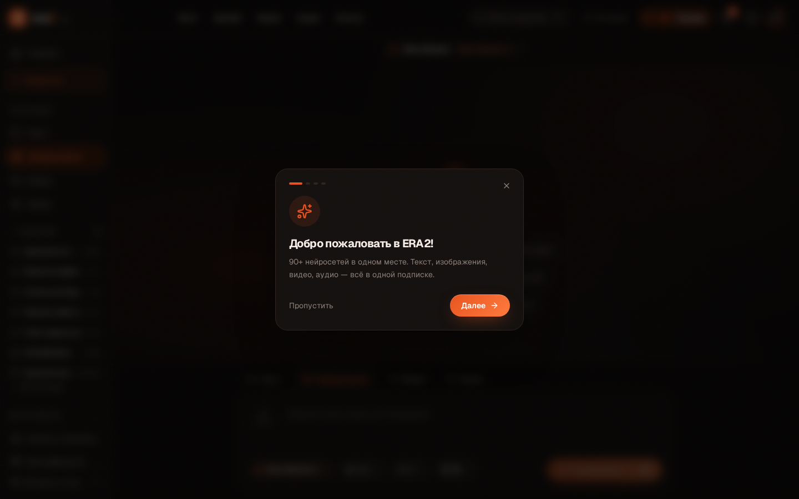
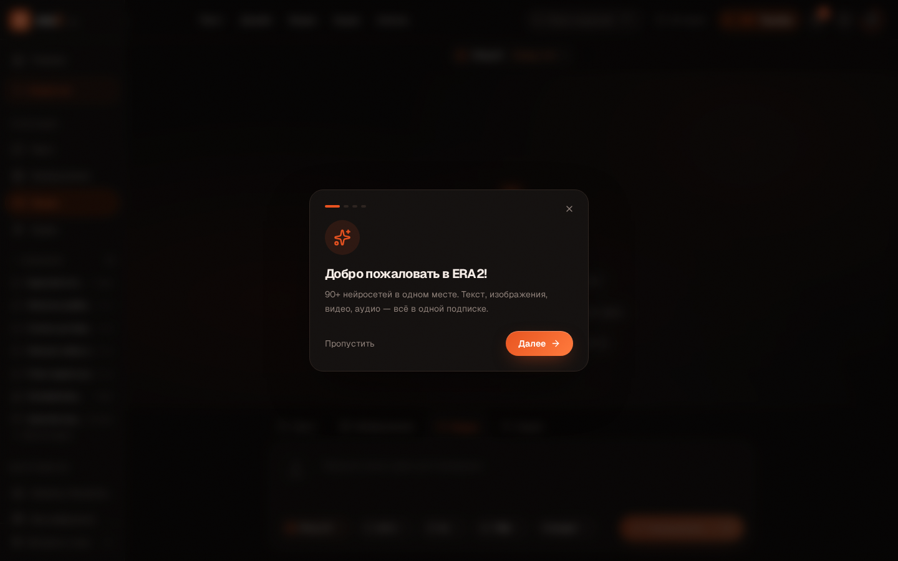
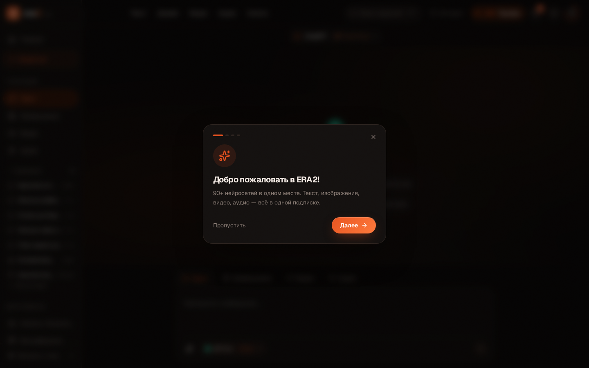
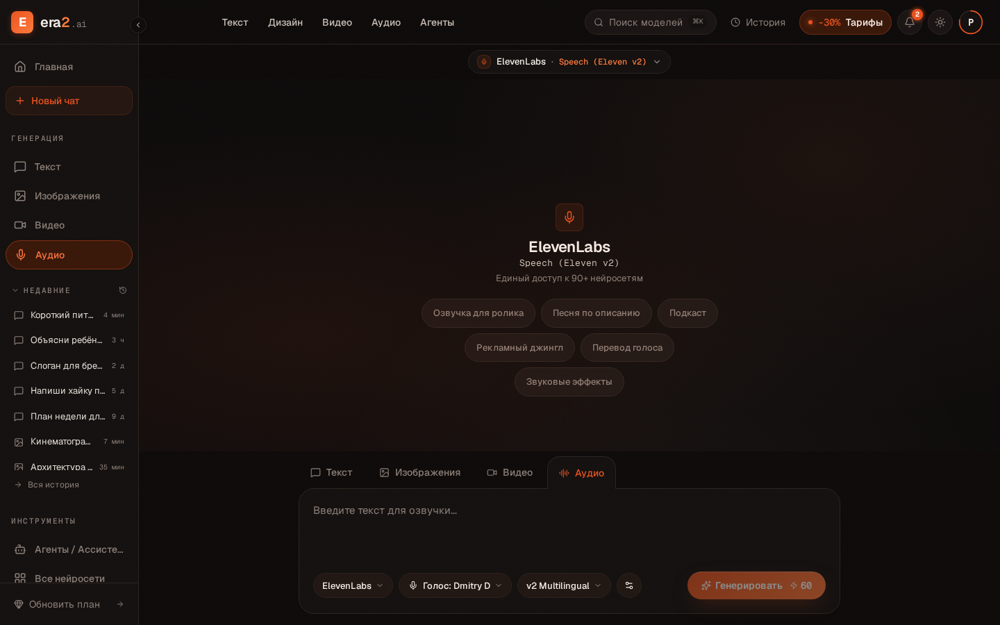
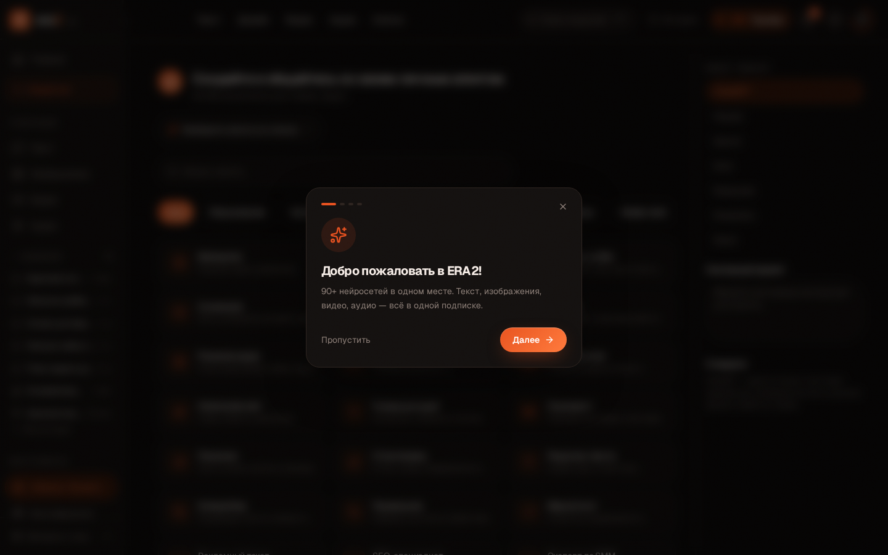
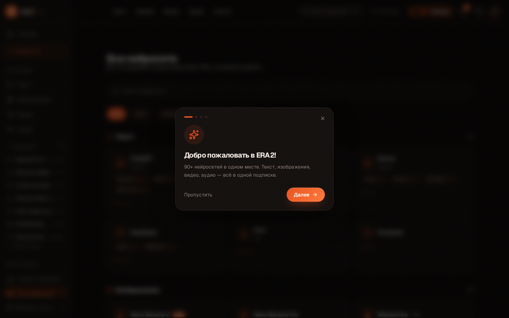
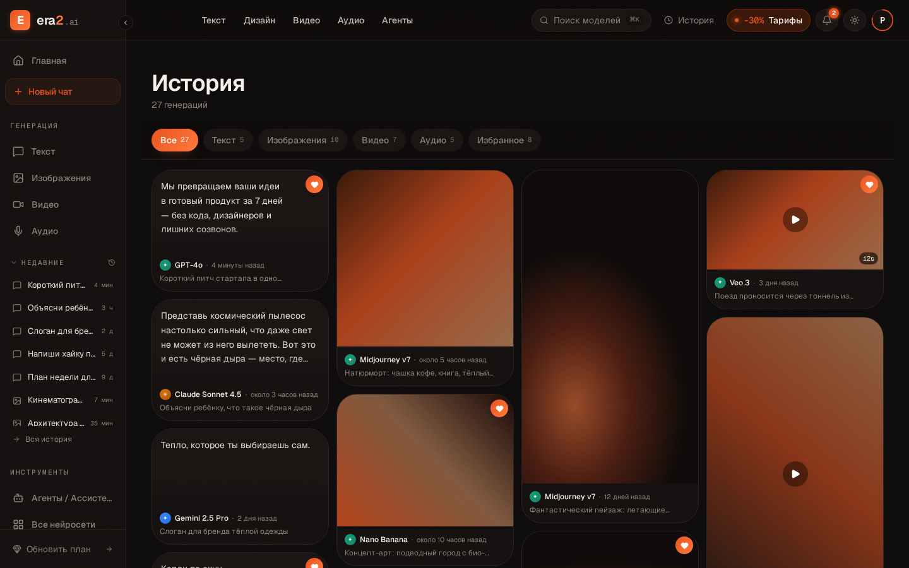
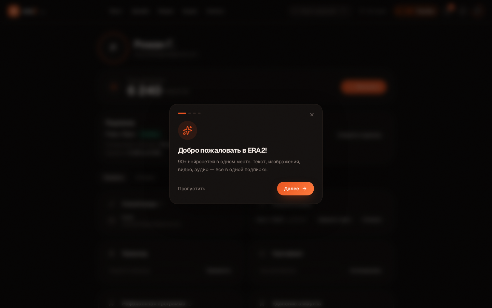

# Аудит рабочих областей ЭРА2 — материал для спеки «воркспейсы к запуску»

**Дата:** 2026-07-27  
**Метод:** Playwright headless, viewport 1440×900, авторизация — мок `era2_auth=true` в `localStorage`. Онбординг и Daily Check-in подавлены флагами `era2_onboarding_done`, `era2_checkin_seen`, `era2_checkin_claimed`.  
**Источник:** `http://localhost:8080` (dev-preview).  
**Ограничение по Pollo:** сайт закрыт Cloudflare-интерстишиалом для headless-браузера в песочнице — авторизованный кабинет Романа поднять не удалось. Раздел 3 собран из публично-видимой верхней навигации Pollo (`/create`, `/text-to-video`, каталог left-tree) плюс референс общеизвестного паттерна «tool tree → params → generate → queue → history». Скрины лендингов Pollo приложены; интерактив кабинета требует ручной перепроверки со стороны Романа — пункты, помеченные (**?**), проверить в его залогиненной сессии.

---

## 1. Разбор рабочих разделов ЭРА2

Все скрины: `docs/qa/workspace-audit/screens/*.png`.

### 1.1 `/design` — генерация изображений

- **Каркас:** левый сайдбар (Главная / Новый чат / Генерация: Текст·Изображения·Видео·Аудио / Недавние / Инструменты), центр — welcome-блок (иконка модели, имя, сабмодель, шапка «Единый доступ к 90+»), внизу — sticky-панель промпта с табами Текст/Изображения/Видео/Аудио (быстрое переключение на соседний воркспейс).
- **Панель генерации:** textarea `Введите свою идею для генерации`, счётчик `0/14` (сегментация промпта), «плюс» слева = вложение (визуально есть, обработчика не видно). Параметры справа: селектор модели (Nano Banana 2), aspect (1:1), quantity (1), quality (2K). Кнопка `Генерировать + 300` — цена в кредитах отрисована.
- **По клику «Генерировать»:** `isGenerating=true`, запускается `<GenerationLoader type="image">` c ложным ожиданием `setTimeout 2–4 s`. Результат — карточка в `MediaChatFeed`: пользовательский пузырь + ответ модели, но само изображение — `<Placeholder tone="rust|ember" aspect="1/1">` с подписью размерности. Реальных пикселей нет. Действия под карточкой: «Промпт», «Поделиться» (копирует фейковый `/share/{id}`), «Скачать» (без обработчика), «В избранное» (без обработчика).
- **Скролл-фид** заменяет welcome-блок после первой генерации (сессия). При перезагрузке ленты — пустой стейт.
- **Загрузочный стейт:** есть (`GenerationLoader`, glow-border вокруг textarea).
- **Ошибки:** обработки нет — генерация не может «упасть».
- **Пустое состояние:** welcome-блок с 6 сценариями-чипами (клик → пред-заполнение textarea).

### 1.2 `/video` — генерация видео

- Каркас идентичен `/design`. Модель — Kling AI, сабмодель Kling 3.0.
- **Панель:** textarea `0/5`, справа Kling 3.0 / 16:9 / 5s / 720p / Стандарт (у Sora/Veo подмешивается селектор функций). Кнопка `Генерировать + 75`.
- **По клику:** тот же `setTimeout 2–4 s`, в фид добавляется `VideoResult` — `Placeholder tone="coal" aspect="16/9"` + кнопка Play + бэдж длительности. Ни `setSrc`, ни обёртки `<video>` нет — плеер не заведён.
- Всё остальное (loader, действия, welcome, ошибки) — как в 1.1.

### 1.3 `/text` — чат / текст

- Отдельная модель UX — чат, не карточка результата.
- **Панель:** одиночная textarea `Напишите сообщение…`, снизу капсула модели (ChatGPT · GPT 5.2 · 6 cr), иконка «скрепка» слева (без обработчика), справа — send-иконка.
- Селекторы поверх шапки: web-search / thinking (у моделей, где поддерживается) — переключаются, но эффекта не имеют.
- **По клику:** пользовательское сообщение добавляется в фид, `setTimeout 800 мс` → assistant-сообщение с зашитым `demoReply` (одинаковый ответ на любой промпт). Стриминга нет.
- **История чата** живёт только в памяти компонента; при уходе на другой воркспейс пропадает. В сайдбаре «Недавние» — статичный мок-список.
- **Ассистенты** (пилюли «Написать текст» и т.п.) — префилл промпта, не отдельный системный контекст.
- Loader / errors / empty — по паттерну 1.1.

### 1.4 `/audio` — озвучка/музыка

- Каркас как у медиа-воркспейсов. Активная модель — ElevenLabs (Speech Eleven v2) с блоком «Выберите голос» (пилюли фильтров: Популярные / Мужские / Женские / Русские; ниже — карточки голосов Dmitry D и т.п.).
- **Панель:** textarea `Введите текст для озвучки…`, селекторы — ElevenLabs / Голос / v2 Multilingual / скорость. Кнопка `Генерировать + 60`. Suno-режим меняет пресеты (жанры, длительность).
- **По клику:** `setTimeout 2–4 s` → `AudioResult` — статичная волна из 28 sin-баров + фиксированная длительность из мока (`0:18`, `0:58` и т.п.). `<audio>` не создан, play-кнопка ничего не проигрывает.
- Loader / actions / welcome / errors — как в 1.1.

### 1.5 `/agents` — каталог ассистентов

- Это НЕ воркспейс генерации, а каталог. Центр — поиск, табы категорий (Все/Образование/Контент/Маркетинг/Бизнес/Разработка/Здоровье/Лайфстайл), сетка карточек (44 агента).
- Правая колонка (`xl:`): «Выбор модели» (радио ChatGPT/Claude/…/Qwen), «Системный промпт» (textarea без сохранения), «О модели» (описание).
- **По клику на карточку агента** → `navigate('/text')` без передачи ID, системного промпта или модели. Ассистент теряется на пороге.
- Пустое состояние — «Агенты не найдены».
- Кнопки/лоадеры/ошибки — не применимо.

### 1.6 `/toolkit` — каталог моделей

- Витрина `Все нейросети`: поиск, табы (Все/Текст/Изображения/Видео/Аудио), группы карточек по типам с чипами вариантов и подписью «от N cr».
- Не воркспейс — навигация в соответствующий раздел (переход через клик на карточку/модель, но обработчиков click на карточках сейчас не видно; полезность — визуальный каталог + якоря).
- Пустого / ошибочного стейта нет.

### 1.7 `/history` — история генераций

- H1 «История», подсчёт «27 генераций», табы-фильтры со счётчиками (Все 27 / Текст 5 / Изображения 10 / Видео 7 / Аудио 5 / Избранное 8).
- Сетка карточек `HistoryCard` (masonry-ощущение), клик → `HistoryDetailDialog`. Кнопка сердечка на карточке — тумблер `favorite` в локальном state (`setItems`), при перезагрузке сбрасывается на `MOCK_HISTORY`.
- Источник — `src/data/mockHistory.ts`, статический. Никакого связывания с генерациями из `/text|/design|/video|/audio` (там свой in-memory state, сюда не пишется).
- Пустое состояние: `Inbox` иконка + подпись «нет» (появляется, если фильтр не находит).
- Loader / errors — не заведены.

### 1.8 `/account` — профиль и подписка

- Аватар + имя + email; блок баланса (`6 240 кредитов`, кнопка `Пополнить` → `/pricing` или `/checkout`); карточка подписки (План «Про», Активна, дата списания, `Отменить подписку`), таб «Профиль/История»; способ входа, способ оплаты (`Заменить карту` / `Отвязать`), Промокод (`Применить`), Сертификат (`Активировать`), Реферальная программа (`Копировать` ссылку), Удаление аккаунта.
- Все данные — моки внутри компонента; действия — открывают toast/диалог, ничего не сохраняют.
- Empty/loader/error — не предусмотрены.

---

## 2. Готовность vs макет, расхождения

### 2.1 Что реально «собирает запрос» (готово к бэку без переработки UX)

| Воркспейс | Что уже собирается в state |
|---|---|
| `/design` | `prompt`, `providerId`, `subModelId`, `aspectRatio`, `quantity`, `quality` — полный набор для request DTO (`DesignPage.tsx:170`) |
| `/video` | `prompt`, `providerId`, `subModelId`, `aspectRatio`, `duration`, `resolution` (+ `quality`, `selectedFunc` у Sora/Veo) |
| `/text` | `messages[]`, `providerId`, `subModelId`, флаги `webSearch`/`thinking`, вложения (кнопка есть — обработчика нет) |
| `/audio` (ElevenLabs) | `prompt`, `voice`, `model`, `speed` |
| `/audio` (Suno) | `prompt`, `genres[]`, `duration`, `sunoVersion` |

Все панели имеют цену в кредитах, disabled-state при пустом промпте и loading-state. Это уровень «дай ручку — заведём».

### 2.2 Что чистые макеты (нет пути к продакшену без переделки)

- **Результат.** Все `Placeholder`-заглушки (`ImageResult`, `VideoResult`, `AudioResult`) не умеют принимать URL/blob — нет ``, `<video>`, `<audio>`. Требуется вменяемый `MediaAsset` тип и рендер.
- **Скачать / поделиться / избранное** — кнопки без обработчиков. Share копирует детерминированный `cheerful-wave-companion.lovable.app/share/{id}`, куда никто ничего не кладёт.
- **Ассистенты `/agents`** — карточки не передают контекст в `/text` (ни `assistantId`, ни системный промпт, ни модель).
- **История ↔ live-генерации** — два несвязанных источника. Всё, что нагенерировано в сессии, при уходе теряется; всё, что в `/history`, — статический мок.
- **`/toolkit`** — каталог без действий: не связан с воркспейсами (клик по карточке ничего не делает).
- **Аудио-плеер** — только визуальная волна, без `<audio>` и без wavesurfer.
- **Ошибки / rate-limit / insufficient-credits** — не отрисованы нигде. Credit-badge только декоративный, списания не происходит.
- **`/account`** — балансы и подписка захардкожены; отмена/замена карты — тосты.
- **Вложения (attach)** в `/text` — кнопка есть, обработчика нет.
- **Онбординг + Daily Check-in** — блокируют перекрытием при первом визите, у Playwright ловятся `intercepts pointer events`.

### 2.3 Единообразие панелей

**Плюсы (единый почерк):**
- Каркас `Sidebar + Header + welcome + sticky panel + tab-switcher` одинаков в `/design`, `/video`, `/audio` и почти совпадает в `/text`.
- Loader (`GenerationLoader` + `glow-border-*`) — единый.
- Feed-карточка (промпт справа + модель слева + результат + toolbar) — единый в `MediaChatFeed`.
- Драфт промпта переживает reload через `sessionStorage.era2_draft_{design|video|text|audio}`.

**Расхождения:**
- **CTA:** `/design`, `/video`, `/audio` — «Генерировать · N cr»; `/text` — иконка-стрелка без цены (и без disabled-визуала при 6 cr).
- **Формат кредитов:** `/design` `+ 300`, `/video` `+ 75`, `/audio` `+ 60`, `/text` `6 cr`. Форматы `+300` / `60` / `6 cr` не унифицированы.
- **Welcome-hero:** `/design`, `/video`, `/audio` рендерят большую иконку и «Единый доступ к 90+ нейросетям» (маркетинговая фраза внутри рабочего окна — странно), `/text` — без hero.
- **Табы Текст/Изображения/Видео/Аудио над панелью** есть на `/design`, `/video`, `/audio`, `/text` — но в `/agents`, `/toolkit`, `/history`, `/account` их нет: разрыв ментальной модели «я всегда могу переключиться в соседний тип».
- **Термин «модель»:** в панели используется `provider + subModel`, в `/toolkit` — «нейросети», в `/agents` — «Выбор модели». Логика та же, слово каждый раз новое.
- **История:** `/history` живёт мок-данными, сайдбар «Недавние» — другой мок, `MediaChatFeed` — третий live-state. Три источника правды.
- **`/agents` vs `/text`**: агенты — отдельная страница-каталог, ассистенты в `/text` — префилл-пилюли. Одна и та же сущность в двух местах.

---

## 3. Эталон Pollo (референс)

> Авторизованные скрины Pollo достать не удалось (CF-бот-чек). Ниже — сводка публично-видимой архитектуры (`pollo.ai/create` + категории `text-to-video`, `image-to-video`, `text-to-image`) и общего паттерна, который Pollo продвигает как «Creative Studio». Пункты (**?**) — перепроверить в залогиненной сессии.

**Целевая модель Creative Studio (Pollo):**

1. **Левая колонка — Tool Tree.** Иерархия `AI Video Generator → Text to Video / Image to Video / Reference to Video / Mimic Motion / Video Editor / Upscaler` и параллельная ветка `AI Image Generator → Image to Image / Photo Editor / Watermark Remover / Magic Eraser / Upscaler / BG Remover / Face Swap`. Выбор ветки = выбор воркспейса, а не переход по URL-каталогу (`pollo_create.png`).

2. **Центральная колонка — панель параметров конкретного tool.** Для Text-to-Video (`pollo_ai-video-generator.png`) видны: Prompt (textarea + Translate Prompt + Enhance), Model picker (Kling / Runway / Luma / Hailuo…), Aspect Ratio, Duration, Resolution/Quality, Seed, Negative Prompt, Reference image (drag-n-drop), Generate CTA с ценой в токенах (**?**).

3. **Правая/нижняя колонка — Queue + Gallery результатов.** Задача уходит в очередь со статусами `queued → processing → done|failed`, прогресс-бар, ETA, отдельная карточка на каждую задачу, retry для failed, кнопки Download / Extend / Upscale / Regenerate / Use as reference (**?**).

4. **История == галерея.** Все прошлые задачи персистятся, доступны через фильтр по типу/модели/дате, из истории можно `Use as input` (кидает результат обратно в панель следующего tool).

5. **Сквозной credit-контекст** в шапке (баланс, стоимость текущего запроса, тултип «недостаточно кредитов → перейти на upgrade»).

6. **Ошибки inline:** failed-таска остаётся в очереди с причиной, `Retry`/`Contact support` рядом.

7. **Download-меню на карточке:** оригинал / вотермарк-фри / MP4/GIF/WebM (для видео), PNG/JPG (для картинок), MP3/WAV (для аудио).

8. **Сохранение промпта/сида** и `Copy settings` кнопка на карточке результата — переиспользуемость.

9. **Publish/Share/Community** — опционально: карточку можно опубликовать в общий feed.

---

## 4. Свод: раздел ЭРА2 → что есть → чего не хватает → фронт или API

| Раздел ЭРА2 | Что уже есть | Чего не хватает до паттерна Pollo | Природа работы |
|---|---|---|---|
| `/design` | Промпт, модель, aspect, quantity, quality, cta с ценой, mock-loader, feed | Реальный запрос, `` рендер результата, download / regen / use-as-ref, seed & negative prompt, очередь параллельных задач, insufficient-credits флоу, error-inline | **Фронт**: seed/negative, download-меню, use-as-ref, empty/error states. **API**: инициация задачи, статус, отдача URL, списание кредитов |
| `/video` | Промпт, модель, aspect, duration, resolution, quality, functions, cta с ценой | Всё то же + `<video>`-плеер с постером, ETA, extend/upscale-actions, i2v и ref2v режимы, длинный polling | **Фронт**: плеер, ETA, режимы i2v (upload + drag). **API**: async pipeline с polling/websocket |
| `/text` | Чат-фид, история сессии, model + sub-model, флаги web/thinking, префилл-ассистенты | Стриминг ответа, реальный контекст ассистента (system prompt из `/agents`), history-persist между воркспейсами, вложения файлов, tool-calls, стоимость сообщения, повтор/редактирование | **Фронт**: attach handler, edit/regen сообщения, ассистент-контекст. **API**: streaming completions, tools, файлы |
| `/audio` | Промпт, голос + фильтры, модель, скорость / жанры / длительность, waveform-заглушка, cta с ценой | `<audio>`-плеер (play/pause/seek), download, preview голоса до генерации, voice-clone upload (**?**) | **Фронт**: реальный player + waveform из данных (wavesurfer), preview голоса. **API**: TTS/music endpoints, sample voices |
| `/agents` | Каталог 44 карточек, поиск, категории, выбор модели, поле «Системный промпт» | Передача выбранного агента в `/text` (id + system prompt + модель), сохранение кастомных агентов, отдельный чат-контекст на агента | **Фронт**: `navigate('/text', { agentId })` + инициализация чата с preset. **API**: CRUD пользовательских агентов, сохранение системного промпта |
| `/toolkit` | Витрина всех моделей с ценами | Клик по карточке → воркспейс с преселектом модели; deep-links; сравнение моделей | **Фронт**: hookup navigation по click, роутинг с `?model=` |
| `/history` | Табы-фильтры, карточки, детальный диалог, избранное (in-memory) | Один источник правды с фидами воркспейсов, persist favorites, download, use-as-input, rerun с теми же параметрами, поиск по промпту | **Фронт**: unified store (Query + Zustand) вместо `MOCK_HISTORY`, actions на карточке. **API**: список генераций пользователя, favorite endpoint |
| `/account` | Профиль, баланс, подписка, оплата, промокод, реферал | Реальные данные пользователя и баланса; отмена/замена карты; история платежей; API-ключи (если нужны) | **Фронт**: небольшая допилка (loader/error). **API**: пользователь, подписка (Stripe/Paddle webhook), биллинг-история |

### Кросс-разрезные пробелы

- **Единый store результатов** (сейчас три источника: `useState` в каждом воркспейсе, `MOCK_HISTORY`, сайдбар «Недавние»). Без него ни Pollo-паттерн, ни deep-link на результат невозможны.
- **Очередь задач** как first-class сущность — сейчас нет вообще.
- **Кредиты как реальный счёт** (не декор). Требуется server-side lock/списание.
- **Ошибки** — единый компонент inline-error + retry.
- **Deep-link на генерацию** (`/g/{id}`) — нет.

---

## Приложения

### A. Скриншоты

Все — 1440×900, авторизованный мок:

- `screens/design.png` — welcome + панель
- `screens/design_filled.png`, `screens/design_after_generate.png` — с заполненным промптом и после клика (2–4 c mock)
- `screens/design_model_picker.png` — раскрытая капсула модели
- `screens/video.png`, `screens/video_filled.png`, `screens/video_after_generate.png`
- `screens/text.png`, `screens/text_after_assistant.png`, `screens/text_after_click.png`
- `screens/audio.png`, `screens/audio_filled.png`, `screens/audio_after_generate.png`
- `screens/agents.png`, `screens/toolkit.png`, `screens/history.png`, `screens/account.png`
- Pollo (гость / CF): `screens/pollo_create.png`, `screens/pollo_ai-video-generator.png`, `screens/pollo_text-to-video.png`, `screens/pollo_image-to-video.png`, `screens/pollo_text-to-image.png`, `screens/pollo_image-generator.png`, `screens/pollo_text-to-video-ai.png`

### B. Ссылки в коде на моки/заглушки

- `src/pages/DesignPage.tsx:170` — `setTimeout` мок-генерация
- `src/pages/VideoPage.tsx:147` — то же
- `src/pages/TextPage.tsx:137` — `demoReply` статичный ответ
- `src/pages/AudioPage.tsx:170` — то же
- `src/components/workspace/MediaChatFeed.tsx:39-98` — `Placeholder` вместо реального медиа, `share` захардкожен
- `src/data/mockHistory.ts` — 27 фейковых записей
- `src/data/mockGenerations.ts`, `src/data/placeholderImages.ts` — сопутствующие моки
- `src/pages/AgentsPage.tsx:146` / `:204` — клик по агенту `navigate('/text')` без контекста
- `src/components/shared/OnboardingTour.tsx`, `src/components/shared/DailyCheckIn.tsx` — модалки с `z-[100]/[101]`, блокируют интерактив до `era2_onboarding_done` / `era2_checkin_seen`
